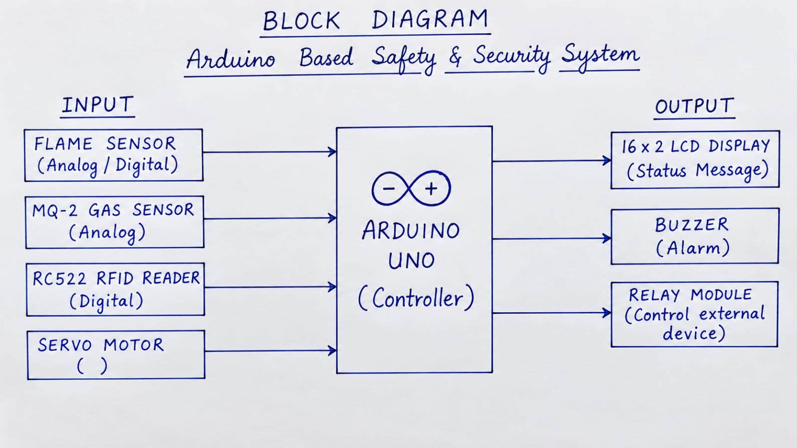
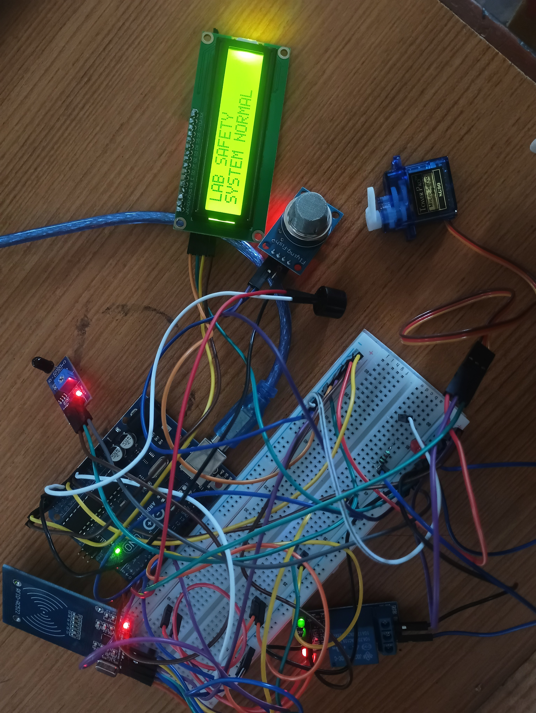

Smart Laboratory Safety System:

The Smart Laboratory Safety System reliably monitors key laboratory hazards in real time. The flame sensor catches fire risks early, while the MQ-2 sensor flags dangerous gas or smoke buildup before it becomes critical. The RFID module adds a layer of access control, ensuring only authorized personnel can interact with sensitive areas. Combined with instant LCD feedback and audible/relay-based alerts, the system offers a compact, low-cost, and effective way to improve safety awareness and response time in a lab setting.

 Future Improvements:

\-  Add Wi-Fi/IoT connectivity for remote monitoring  
\-  Push real-time alerts to a mobile app  
\-  Integrate temperature and humidity sensors  
\-  Automate emergency exhaust fan control  
\-  Log safety events to a database  
\-  Build a web/mobile dashboard for live tracking

 License:

This project is open-source — feel free to modify and build upon it for educational or personal use. 🔥 Smart Laboratory Safety System

An Arduino UNO-based safety monitoring system that detects fire, gas/smoke leaks, and unauthorized access in a laboratory environment — with real-time alerts via buzzer, relay, and LCD display.

 Overview:

Laboratories deal with flammable chemicals, gas cylinders, and sensitive equipment, which makes safety monitoring critical. This project uses an Arduino UNO to continuously watch for fire and gas hazards while also controlling access through RFID authentication. When a threat is detected, the system immediately triggers a buzzer alarm and activates a relay-controlled safety device (like an exhaust fan or power cutoff), while showing live status updates on an LCD screen.

 Features:

\- Fire Detection\*\* — Flame sensor detects open flames in real time  
\- Gas/Smoke Detection\*\* — MQ-2 sensor picks up harmful gas or smoke levels  
\- RFID Access Control\*\* — Verifies authorized personnel via RFID cards  
\- Audible Alerts\*\* — Buzzer sounds an alarm when danger is detected  
\- Relay-Controlled Output\*\* — Automatically switches on a fan, exhaust, or power supply during emergencies  
\- LCD Status Display\*\* — Shows live safety status at all times  
\- Serial Monitor Logging\*\* — Outputs sensor readings for debugging and monitoring

 Hardware Required:

| Component | Quantity |  
|---|---|  
| Arduino UNO | 1 |  
| Flame Sensor | 1 |  
| MQ-2 Gas/Smoke Sensor | 1 |  
| RC522 RFID Module \+ Tags | 1 |  
| 16x2 I2C LCD Display | 1 |  
| Buzzer | 1 |  
| 1-Channel Relay Module | 1 |  
| Breadboard | 1 |  
| Jumper Wires | As needed |  
| USB Cable | 1 |  
| Power Supply | 1 |

 Circuit Connections:

| Component | Pin | Arduino Pin |  
|---|---|---|  
| Flame Sensor | D0 | D2 |  
| Buzzer | \+ | D5 |  
| Relay | IN | D6 |  
| MQ-2 Gas Sensor | A0 | A0 |  
| RFID (RC522) | SDA/SS | D10 |  
| RFID (RC522) | RST | D9 |  
| RFID (RC522) | MOSI | D11 |  
| RFID (RC522) | MISO | D12 |  
| RFID (RC522) | SCK | D13 |  
| LCD (I2C) | SDA | A4 |  
| LCD (I2C) | SCL | A5 |

 How It Works:

1\. The Arduino UNO initializes all connected sensors and modules on startup.  
2\. The flame sensor continuously checks for the presence of fire.  
3\. The MQ-2 sensor monitors the surrounding air for smoke or hazardous gas.  
4\. The RFID reader scans for authorized access cards.  
5\. The LCD constantly updates to reflect the current system status.  
6\. If fire or gas is detected, the buzzer and relay activate immediately.  
7\. If a valid RFID card is scanned, the system reads and displays the card info.  
8\. Under normal conditions, the LCD simply reads \*\*"SYSTEM NORMAL."\*\*

Setup Instruction:  
 1\. Arrange the Components  
Lay out the Arduino UNO, sensors, LCD, RFID module, buzzer, and relay on your workspace or breadboard.

 2\. Wire the Power Rails  
\- Arduino \`5V\` → Breadboard \`5V\`  
\- Arduino \`GND\` → Breadboard \`GND\`

 3\. Connect the Flame Sensor  
\- \`VCC\` → 5V  
\- \`GND\` → GND  
\- \`D0\` → D2

4\. Connect the MQ-2 Gas Sensor  
\- \`VCC\` → 5V  
\- \`GND\` → GND  
\- \`A0\` → A0

 5\. Connect the Buzzer  
\- \`+\` → D5  
\- \`–\` → GND

 6\. Connect the Relay Module  
\- \`VCC\` → 5V  
\- \`GND\` → GND  
\- \`IN\` → D6

7\. Connect the RFID Module (RC522)  
\- \`VCC\` → \*\*3.3V\*\*  
\- \`GND\` → GND  
\- \`SDA/SS\` → D10  
\- \`RST\` → D9  
\- \`MOSI\` → D11  
\- \`MISO\` → D12  
\- \`SCK\` → D13

 8\. Connect the LCD (I2C)  
\- \`VCC\` → 5V  
\- \`GND\` → GND  
\- \`SDA\` → A4  
\- \`SCL\` → A5

 9\. Install Required Libraries  
In the Arduino IDE, install:  
\- \`Wire\`  
\- \`LiquidCrystal\_I2C\`  
\- \`SPI\`  
\- \`MFRC522\`

10\. Upload the Code  
1\. Connect the Arduino UNO to your computer via USB.  
2\. Open the Arduino IDE.  
3\. Select \*\*Board:\*\* Arduino UNO.  
4\. Select the correct \*\*COM Port\*\*.  
5\. Open the project sketch.  
6\. Click \*\*Verify\*\* to compile the code.  
7\. Click \*\*Upload\*\* to flash it to the board.

 11\. Test Everything  
\- Bring a flame near the flame sensor to confirm fire detection.  
\- Test smoke/gas detection using the MQ-2 sensor.  
\- Scan an RFID card to verify access detection.  
\- Confirm the LCD updates correctly.  
\- Check that the buzzer sounds during alerts.  
\- Verify the relay switches on/off as expected.

 System Behavior

| Condition | System Response |  
| Normal | LCD shows \`SYSTEM NORMAL\` |  
| Flame Detected | \`FIRE ALERT\` \+ Buzzer \+ Relay ON |  
| Smoke/Gas Detected | \`SMOKE ALERT\` \+ Buzzer \+ Relay ON |  
| RFID Card Scanned | \`RFID CARD DETECTED\` |

 Project Flow Chart:
Project Image:
